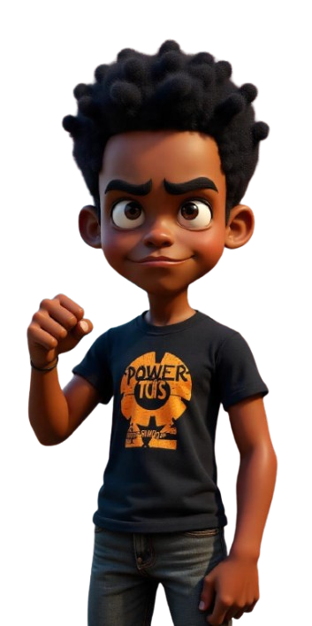
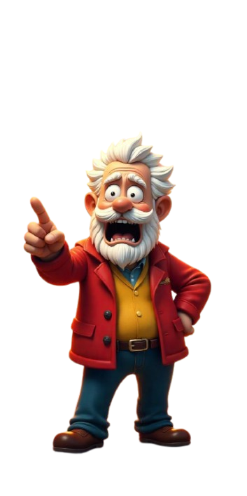
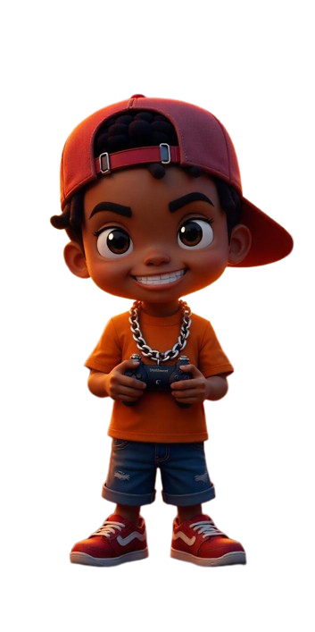

# Nom du jeu

E3 CCSN, OGANDAGA WORA Xavier

## Sujet

explique en 1 ou 2 ligne le sujet

## 1. Brainstorming

pour le faire le brainstorming on va commencer par cette idée : 

```
Je souhaite faire un jeu video basé sur une série animé "Boondocks" avec un style funky en 3D pour une api sur telephone et ordinateur.
```


## 2. Identité

Pour notre jeu nommé **SoulsVille ShowDown** nous avons donc choisis avec *FreePik* :


```
Create a logo for a video game called "soulsville showdown" that reflects the spirit of the animated series "Boondocks" and the main characters Huey, Riley, and Grandad. The logo should be colorful, vibrant, and representative of the game's funky and humorous vibe. semi realistic style
```

## 3.Concept Art
--------

Certains modèle pour comprendre : 

HUEY

GRANDAD

RILEY



## 4. Naration


## 5. Musique et Bande-Son